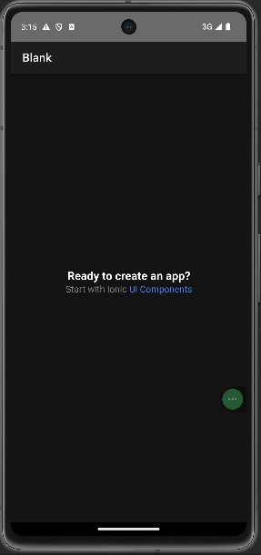
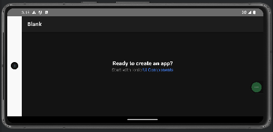

# Android Bars

In an Android Capacitor application there are several Native UI components that you may want to style:
- The Status Bar
- The Navigation Bar
- The Gesture Bar
- The Splash Screen
- The "Notch" or area around the camera
- Dark mode

In a default Capacitor application these look like:

And in landscape mode:
