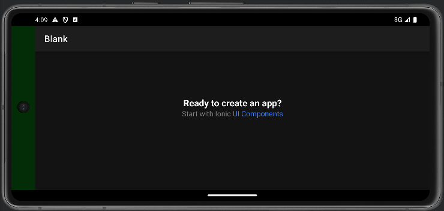

# Android Bars

In an Android Capacitor application there are several Native UI components that you may want to style:
- [Status Bar](#status-bar)
- [Navigation Bar](#the-navigation-bar) (gesture or 2/3 button)
- [Splash Screen](#splash-screen)
- ["Notch"](#the-notch--dark-mode) or area around the camera
- [Dark mode](#what-about-dark-mode)

In a default Capacitor application these look like:


To style these you may need to use plugins or modify your Android project in ways that are not well documented.

## The Notch & Dark Mode

The notch bar / area is hidden beneath the status bar when the device is in portrait mode, and in landscape mode the area has its unique color. In the screenshot above you can see that the notch has a white background (in landscape dark mode), and in portrait mode it is grey when 2/3 button navigation is used in light mode, and is black when gesture navigation is used. Confusing right? Lets see if we can improve this.

### Styles.xml

The file `android/app/src/main/res/values/styles.xml` by default contains:
```xml
<?xml version="1.0" encoding="utf-8"?>
<resources>
    <style name="AppTheme" parent="Theme.AppCompat.Light.DarkActionBar">
        <item name="colorPrimary">@color/colorPrimary</item>
        <item name="colorPrimaryDark">@color/colorPrimaryDark</item>
        <item name="colorAccent">@color/colorAccent</item>
    </style>

    <style name="AppTheme.NoActionBar" parent="Theme.AppCompat.DayNight.NoActionBar">
        <item name="windowActionBar">false</item>
        <item name="windowNoTitle">true</item>
        <item name="android:background">@null</item>
    </style>


    <style name="AppTheme.NoActionBarLaunch" parent="Theme.SplashScreen">
        <item name="android:background">@drawable/splash</item>
    </style>
</resources>
```

We can alter the background color of the notch area by altering the `style` named `AppTheme.NoActionBar` and changing `android:background`:

```xml
<item name="android:background">#00FF00</item>
```

`#00FF00` is the hex value for a bright green, and the result looks like this in landscape mode:


### What about Dark Mode?

You may want to alter the notch background color based on whether the device is in dark mode or not.

To achieve this we need to create a new folder called `values-night` in `android/app/src/main/res`. Tip: Don't try to create the folder in Android Studio, it gets confused.

After creating the folder copy your `styles.xml` from the `values` folder into `values-night`. Then alter the color for the notch to a value that will be used for dark mode:

```xml
<item name="android:background">#003300</item>
```

Now, change your Android device to Dark mode, then restart the app (you must restart the app as styles.xml is only read on startup).

Here is what the app look like in dark mode using the dark green (#003300) we defined:



## The Navigation Bar

The navigation bar is, by default, black in dark mode and white in light mode. We can change these colors but it does require a plugin. We can install one:

```bash
npm install @hugotomazi/capacitor-navigation-bar
```

Then in the startup of our app we can set the color:
```typescript
import { NavigationBar } from '@hugotomazi/capacitor-navigation-bar';
...
NavigationBar.setColor({ color: '#00FF00', darkButtons: true });
```

The end result is the navigation bar is changed to green (`#00FF00`):


### What about Dark Mode?

We can use a little code to detect Dark Mode and change the color:
```typescript
const darkMode = window.matchMedia && window.matchMedia('(prefers-color-scheme: dark)').matches;
const color = darkMode ? '#003300' : '#00FF00';
NavigationBar.setColor({ color: color, darkButtons: darkMode });
```

As you can see the navigation bar is now the dark green (`#003300`) when in dark mode.


## Splash Screen

The Android Splash Screen has changed in Android 12 and above to display the App's icon centered. The background color is either white or black in dark mode.

To modify the background color you need to add `windowSplashScreenBackground` to the file `android/app/src/main/res/values/styles.xml`:

```xml
    <style name="AppTheme.NoActionBarLaunch" parent="Theme.SplashScreen">
        <item name="android:background">@drawable/splash</item>
        <item name="windowSplashScreenBackground">#00FF00</item>
    </style>
```

You can also choose a different color for Dark Mode using the same technique [as described before](#what-about-dark-mode) by setting `windowSplashScreenBackground` in the   `values-night` folder.

Tip: You can create your splash screen and icon assets using [this guide](https://capacitorjs.com/docs/guides/splash-screens-and-icons).

## Status Bar